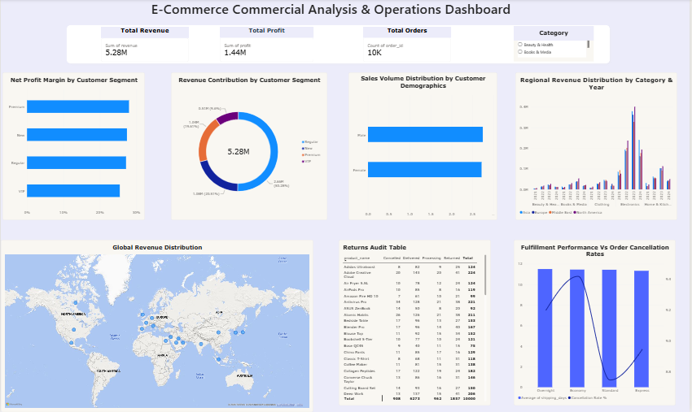

# E-Commerce Commercial Analysis & Fulfillment Operations Audit
> **An End-to-End Enterprise Data Warehouse & Business Intelligence Pipeline**

## Executive Project Summary
This project delivers a production-grade relational database and business intelligence framework built to audit global retail sales vectors and logistics fulfillment efficiencies. By moving raw e-commerce transaction logs through a structured ETL pipeline into a customized Star Schema, this analytical suite exposes operational friction points where premium distribution tiers fail to meet service benchmarks—directly causing consumer order drop-offs and impacting corporate profit margins.

* **Total Active Revenue Managed:** $5,284,387  
* **Total Transactions Audited:** 10,000 Distinct Orders  
* **Calculated Corporate Profit Margin:** 27.21% ($1,437,600 Net Return)
* **Total Units Marketed:** 27,313 Items Sold

---

## Interactive Dashboard Interface


*Features a responsive unified design utilizing rounded-shape containers, regional cross-filtering tracking geo-localization deviations, and a custom product category hierarchy slicer tracking performance by year.*

---

## Architecture Pipeline & Modeling
1. **Staging:** Ingestion of raw transactional flat text exports into an explicit operational workspace.
2. **Database Engine & Transformation:** Structured validation handling formatting faults (e.g., text date conversions, duplicate handling) on a local **MySQL Server**.
3. **Data Modeling:** Decoupling flat records into a highly scalable, one-to-many **Star Schema framework** connecting central facts (`fact_sales_orders`) directly to distinct dimensional indices (`dim_customers`, `dim_products`, `dim_date`, `dim_shipping`).
4. **Visual Intelligence Canvas:** Native live data connection to **Power BI Desktop**, incorporating dynamic DAX calculation layers.

---

## Comprehensive Strategic Insights & Operational Recommendations

### 1. Customer Cohort Profitability & Risk Analysis
* **The Baseline:** **Regular, Premium, and VIP customer segments** demonstrate stable purchasing habits and consistently generate reliable net profits for the enterprise. 
* **The New Buyer Volatility:** Acquisition metrics reveal that **New Customers are highly volatile and unpredictable**. This segment generated the company's highest-margin individual order (**\$1,198.69**), but concurrently drove the deepest operational losses (plummeting to **-\$50.80** per transaction).
* **Strategic Action Required:** The marketing and finance teams must immediately audit first-time buyer promotional mechanics, cross-border discount thresholds, and introductory shipping subsidies to eliminate negative-margin entry orders without alienating high-value premium spenders.

### 2. Supply Chain Logistics & SLA Performance Failure
* **The Flatline Bottleneck:** Granular transit logs prove that **Overnight shipping averages a slow 11.5 days to deliver**—matching Economy (**11.5 days**) exactly, and failing to achieve any statistical speed differentiation over Standard (**11.4 days**) or Express (**11.3 days**).
* **The Cancellation Core Link:** Customers paying premium rates for expedited fulfillment are experiencing the exact same warehouse backlogs as budget tiers. This systemic SLA failure directly drives customer fatigue, pushing order cancellation rates to their highest peaks in **Economy (9.42%)** and **Overnight (9.20%)**, whereas **Standard shipping** maintains the lowest friction at **8.75%**.
* **Strategic Action Required:** Warehouse processing workflows, fulfillment sorting priority lines, and carrier priority queues must be audited immediately. Expedited tiers must receive physical SLA sorting priority within the fulfillment center before freight handoff.

### 3. Macro Geographic Penetration & Market Uniformity
* **The Volume Engine:** Cross-border tracking isolates **Asia (Regular segment)** as a major core driver, capturing **\$722,737 in total revenue across 1,258 distinct orders**.
* **The Margin Efficiency Leader:** While Asia leads in absolute gross volume, **North America generated higher total profitability (\$184,617)** compared to Asia (**\$184,539**), proving superior market margin efficiency per unit sold.
* **Global Consistency:** Baseline repeat buyers (**Regular segment**) perform remarkably uniformly across **Asia, North America, Europe, and the Middle East**, tightly clustering within a stable **\$600K to \$722K revenue range**. This establishes a predictable, dependable global revenue floor across borders.
---

## Technical Code Highlights

### Advanced Trajectory Analytics (SQL Window Functions)
```sql
WITH MonthlySales AS (
    SELECT d.year, d.month, SUM(f.revenue) AS current_month_revenue
    FROM fact_sales_orders f
    JOIN dim_date d ON f.order_date = d.order_date
    GROUP BY d.year, d.month
)
SELECT year, month, ROUND(current_month_revenue, 2) AS revenue,
       ROUND(LAG(current_month_revenue, 1) OVER (ORDER BY year, month), 2) AS previous_month_revenue,
       ROUND(((current_month_revenue - LAG(current_month_revenue, 1) OVER (ORDER BY year, month)) / LAG(current_month_revenue, 1) OVER (ORDER BY year, month)) * 100, 2) AS mom_growth_pct
FROM MonthlySales
ORDER BY year ASC, month ASC;
```
### Deep-Dive Revenue Trajectory Analysis
* **Early 2021 Performance:** Revenue exhibited an initial decline, **dropping ~20% total over Q1**, before experiencing a pivotal inflection point in April with a **+275.42% MoM revenue surge**. Subsequent months (May through July) demonstrated a healthy stabilization phase, maintaining a consistent monthly baseline **above \$30,000** with steady single-digit growth.
* **Late 2024 Performance:** 2024 reveals a sustained and compounding revenue decline. Unlike the rapid Q2 recovery seen in 2021, late 2024 exhibited severe fatigue, culminating in a **-68.53% drop in November** and an all-time low of **\$5,898.51 in December**.
* **Strategic Outlook:** This multi-month acceleration of revenue losses suggests severe underlying **operational, inventory, or demand disruption** toward the end of 2024 that requires immediate root-cause investigation before setting 2025 targets.

### True Weighted Corporate Efficiency (Power BI DAX)
```dax
Total Profit Margin % = 
DIVIDE(
    SUM(fact_sales_orders[profit]), 
    SUM(fact_sales_orders[revenue])
)
```

